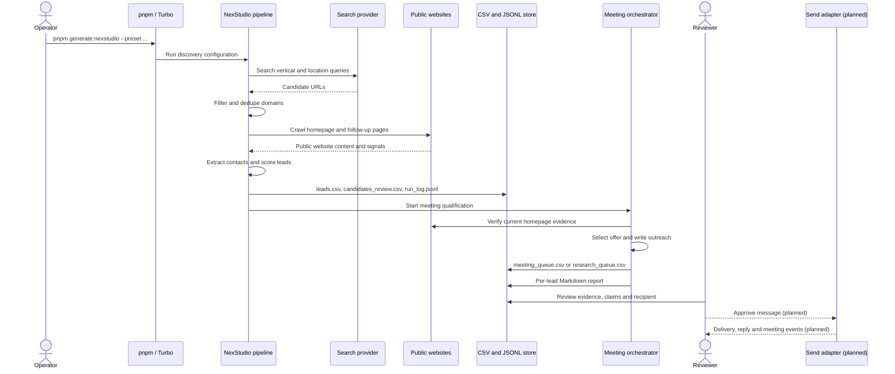
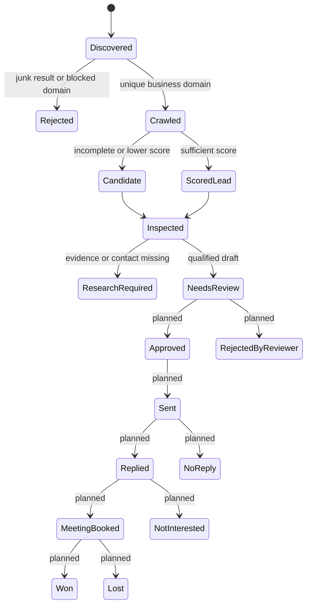
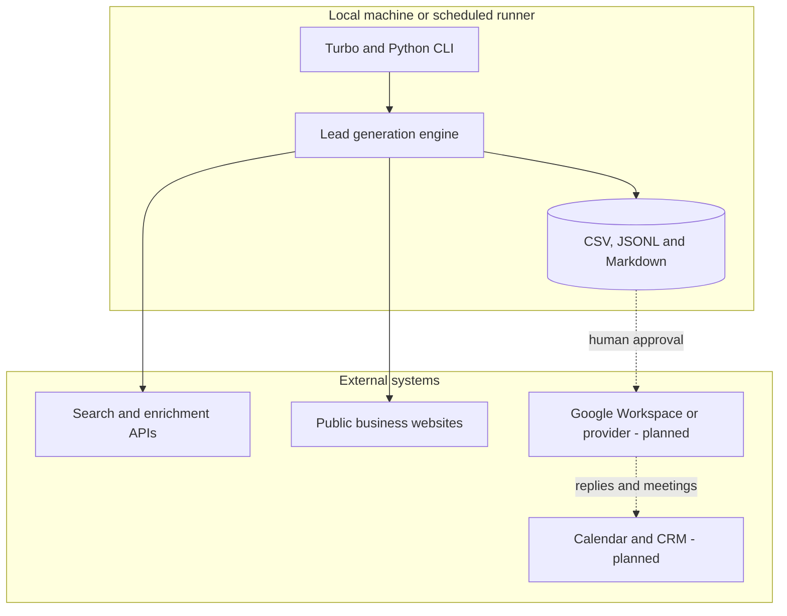

# NexStudio Lead-to-Meeting Architecture

This repository discovers service businesses, verifies their websites, identifies
specific sales opportunities, and prepares evidence-based outreach for human
review. The commercial goal is a qualified meeting for a focused USD 1,000-2,000
engagement, not a generic website lead or an automatically sent cold email.

## Status Legend

- **Implemented:** Runs from the repository today.
- **Partial:** Exists, but is not connected to the main end-to-end command.
- **Planned:** Required for a complete sending, reply, and meeting feedback loop.

## System Architecture

```mermaid
flowchart LR
    subgraph Sources[Lead sources]
        Maps[Google Maps results]
        Dorks[Search dorks]
        Directories[Niche directories]
        Seeds[Seed and lookalike files]
        Opportunities[Website opportunity search]
    end

    subgraph Discovery[Discovery and verification - implemented]
        Targeting[Vertical and location presets]
        Providers[Serper, Brave, SerpAPI, CSV and JSON adapters]
        SearchFilter[Junk result and blocked-domain filter]
        DomainDedupe[Domain deduplication]
        Crawler[Robots-aware website crawler]
        Extractor[Contact, booking, social and page extraction]
        LeadScore[Lead scoring]
    end

    subgraph Evidence[Evidence and offer selection]
        HomepageAudit[Homepage conversion inspection]
        DeepAudit[Deep SEO and competitor audit - partial]
        OfferMatcher[Offer matcher]
        Qualification{Qualified for outreach?}
    end

    subgraph Outreach[Meeting outreach - implemented through review]
        MeetingQueue[Meeting queue]
        ResearchQueue[Research queue]
        LeadBrief[Lead report, email draft and call notes]
        HumanReview[Human review and approval]
    end

    subgraph Delivery[Delivery and learning loop - planned]
        SendAdapter[Google Workspace or email provider adapter]
        ReplyTracker[Reply and bounce tracking]
        Scheduler[Meeting scheduler]
        CRM[CRM and outcome store]
        Feedback[Source, offer and copy feedback]
    end

    Maps --> Providers
    Dorks --> Providers
    Directories --> Providers
    Seeds --> Providers
    Opportunities --> Providers
    Targeting --> Providers
    Providers --> SearchFilter --> DomainDedupe --> Crawler --> Extractor --> LeadScore
    LeadScore --> HomepageAudit
    HomepageAudit --> OfferMatcher
    DeepAudit -. adds stronger evidence .-> OfferMatcher
    OfferMatcher --> Qualification
    Qualification -->|yes| MeetingQueue --> LeadBrief --> HumanReview
    Qualification -->|needs research| ResearchQueue
    HumanReview -. approved .-> SendAdapter
    SendAdapter -.-> ReplyTracker
    ReplyTracker -.-> Scheduler
    ReplyTracker -.-> CRM
    Scheduler -.-> CRM --> Feedback
    Feedback -. improves .-> Targeting
    Feedback -. improves .-> OfferMatcher
```



Solid arrows represent the current automated path. Dotted arrows are partial or
planned integrations.

## Runtime Flow



## Project Responsibilities

| Project | Responsibility | Primary output |
| --- | --- | --- |
| `google-maps-local-flow` | Find local businesses from map results | Search result JSON |
| `apollo-enriched-dork-flow` | Combine search discovery with Apollo enrichment | Enriched organization and contact records |
| `niche-directory-seed-flow` | Turn curated industry directories into seeds | Domain seed records |
| `website-opportunity-flow` | Find sites with observable website opportunities | Opportunity seeds |
| `lookalike-seed-flow` | Expand from known good clients or prospects | Similar prospect seeds |
| `personalized-audit-report-flow` | Produce compact website audit reports | Audit Markdown and CSV |
| `lead-to-meeting-orchestrator` | Verify evidence, select an offer, and prepare meeting outreach | Meeting and research queues |
| `nexstudio-outreach-pipeline` | Run discovery and meeting orchestration together | End-to-end NexStudio output |

The five sourcing projects should remain interchangeable. They produce prospect
records for one shared verification and outreach path rather than implementing
five different crawlers, scoring systems, or email writers.

## Core Data Contracts

### Search Result

Minimum fields accepted from a source adapter:

```text
query, title, url, snippet, source, position
```

### Verified Lead

The crawler and scorer add:

```text
domain, homepage_url, business_name, location, industry
emails, phones, social_urls, booking_urls, contact_urls
pages_crawled, evidence, source_score, lead_score
```

### Website Evidence

The meeting orchestrator derives observable signals such as:

```text
service_pages, location_pages, primary_cta, contact_form
booking_flow, chat_widget, trust_proof, analytics
focused_service_page, focused_location_page
```

Negative findings must be phrased as observations from pages actually checked.
The system must not claim that a business lacks CRM automation, follow-up, or
internal processes that cannot be verified from its public website.

### Outreach Decision

Every inspected lead is routed to exactly one of these outputs:

```text
meeting_queue.csv    qualified, evidence-backed, send_status=needs_review
research_queue.csv   missing identity, contact, evidence, or sufficient score
```

Qualified records include the selected offer, price range, evidence, subject,
email body, meeting CTA, and review status. No current command sends email.

## Offer Architecture

The offer matcher maps an observable problem to one concrete engagement:

| Observable condition | Default offer | Typical range |
| --- | --- | --- |
| Missing or weak service/location landing pages | High-Intent Service Page Pack | USD 1,200-1,600 |
| Weak CTA, proof, booking, or conversion path | Website Conversion Sprint | USD 1,000-1,500 |
| Missing chat or public lead-response path | Lead Response Automation Setup | USD 1,500-2,000 |
| Technical SEO and competitor gap with verified evidence | SEO Opportunity Sprint | USD 1,200-2,000 |

The first three offers are implemented in the meeting orchestrator. The SEO
Opportunity Sprint should only become selectable after the deep audit is wired
into the main pipeline and its evidence is stored with each lead.

## Lead State Machine



Today, the automated state machine stops at `NeedsReview` or
`ResearchRequired`.

## Storage Layout

The current runtime is a local batch architecture. CSV, JSONL, and Markdown are
the handoff layer between stages.

```text
data/
  output-nexstudio-leads/
    leads.csv
    candidates_review.csv
    all_leads.csv
    run_log.jsonl
  output-nexstudio-meetings/
    meeting_queue.csv
    meeting_queue.jsonl
    research_queue.csv
    lead_reports/
  reports/
    nexstudio-sample-seo-audit/
```

This is appropriate for controlled batch testing. A database becomes necessary
when sending, reply ingestion, suppression, retries, ownership, and concurrent
operators are introduced.

## Deployment Boundary



Secrets stay in environment variables and must never be written into reports or
CSV exports. Crawling remains robots-aware, source records are deduplicated by
domain, and all outbound claims must be traceable to captured evidence.

## Next Implementation Stages

1. **Automate deep SEO evidence.** Add sitemap, robots, canonical, title/meta,
   schema, indexability, PageSpeed/CrUX, and same-market competitor comparison.
2. **Create a durable prospect store.** Replace cross-stage CSV mutation with a
   small database while keeping CSV export for review.
3. **Add an approval UI or command.** Require explicit approval of recipient,
   evidence, offer, and final copy before sending.
4. **Add the send adapter.** Support Google Workspace OAuth or a transactional
   provider, sending limits, unsubscribe/suppression, and idempotency.
5. **Ingest outcomes.** Track delivered, bounced, replied, booked, won, and lost
   events against the prospect and campaign.
6. **Close the optimization loop.** Compare meeting and revenue outcomes by lead
   source, vertical, evidence type, offer, subject, and CTA.

## Primary Commands

```bash
pnpm generate:nexstudio --preset med_spa --location "Miami, USA" --max-results 30
pnpm generate:audits
pnpm generate:meetings
```

Use `generate:nexstudio` for the current connected discovery-to-review path.
`generate:audits` is still a separate audit-report path until deep SEO evidence is
integrated into the orchestrator.
