# NexStudio AI Lead Generation & Outreach Platform

## Objective

Build a production system that finds high-quality companies, identifies real
decision makers, enriches and verifies contacts, audits websites, generates
personalized outreach, and manages reviewed sending with follow-ups and reply
tracking.

The system is not a mass scraper. It is an Apollo-first qualification and
outreach operating system with website evidence capture, review gates, consent
and suppression controls, rate limits, and full job history.

## Target Architecture

```mermaid
flowchart LR
    Sources[Apollo search] --> Discovery[Lead discovery agent]
    Discovery --> CompanyQueue[company.discovered]
    CompanyQueue --> Research[Research agent]
    Research --> ContactQueue[contact.discovery]
    ContactQueue --> Enrichment[Email enrichment agent]
    Enrichment --> Verify[email.verify]
    Verify --> Audit[Website audit agent]
    Audit --> Analysis[AI analysis agent]
    Analysis --> Scoring[Scoring agent]
    Scoring --> Personalization[Email agent]
    Personalization --> Review[Review queue]
    Review --> Outreach[Outreach agent]
    Outreach --> Events[Delivery events]
    Events --> Followups[Follow-up scheduler]
    Events --> Analytics[Analytics and CRM]
```



## Deployment Topology

```text
apps/web
  Next.js 15 app, dashboard, review queue, settings, auth, API route handlers

apps/worker
  BullMQ processors, Playwright browsers, Lighthouse runner, provider jobs

packages/core
  Domain types, Zod schemas, scoring rules, provider interfaces

packages/db
  Prisma schema, migrations, repositories

packages/queues
  Queue names, job contracts, enqueue helpers

packages/providers
  Apollo, BuiltWith, PageSpeed, Resend, Smartlead adapters

packages/agents
  Discovery, research, audit, AI, scoring, email, outreach services

packages/observability
  Logger, metrics, tracing, audit event helpers
```

Use Vercel for `apps/web`. Use Railway or Fly.io for `apps/worker`, PostgreSQL,
and Redis. Workers must run outside Vercel because Playwright, Lighthouse, and
long-running BullMQ jobs do not belong in serverless request handlers.

## System Modules

### 1. Authentication And Tenancy

- NextAuth with email/OAuth login.
- Organization-scoped data model from day one.
- Roles: owner, admin, researcher, reviewer, sender, read-only.
- Every company, contact, job, template, campaign, and event belongs to an
  organization.
- API authorization checks happen at the route and repository layers.

### 2. Apollo Lead Source

The MVP uses Apollo as the only company and people discovery source. The code
still keeps a provider interface so the system remains testable and a future
Crunchbase enrichment adapter can be added without rewriting the pipeline.

```ts
export interface LeadProvider {
  name: LeadProviderName;
  discover(input: LeadDiscoveryInput): AsyncIterable<DiscoveredCompany>;
}
```

MVP source:

- Apollo organization search.
- Apollo people search.
- Manual CSV import only for importing Apollo exports or existing repository
  outputs during migration.

Explicitly out of MVP:

- Google Maps/SERP discovery.
- Product Hunt.
- YC directory.
- Clutch.
- LinkedIn scraping.
- Broad web crawling for company discovery.

Future optional source:

- Crunchbase enrichment for funding/growth signals after Apollo is stable.

Discovery normalizes domains, dedupes by canonical domain, stores Apollo source
evidence, and queues downstream work. The Apollo adapter must support rate
limits, pagination checkpoints, resumable jobs, and credit-aware search limits.

### 3. Decision Maker Discovery

The decision maker service ranks people before email lookup:

1. Founder, co-founder, CEO, owner.
2. CTO, head of engineering, technology director.
3. Head of marketing, growth lead, revenue leader.
4. Vertical-specific roles such as medical director or practice owner.

Fallback evidence sources:

- Public LinkedIn profile URLs returned by Apollo or manual import.
- Company team/about/contact pages for role confirmation.
- Impressum pages for German businesses when relevant.
- GitHub organization metadata only for technical companies.

The service never prioritizes generic inboxes. Generic emails are stored as
company contact channels and excluded from sending unless explicitly approved.

### 4. Email Enrichment And Verification

Provider order:

1. Apollo person enrichment.
2. Apollo email reveal when approved by budget settings.
3. Pattern guessing only when a named decision maker and strong domain evidence
   exist.
4. Verification check before send eligibility.

Hunter and Snov are not part of the MVP. They can be added later only if Apollo
coverage is insufficient and the cost/quality tradeoff is clear.

Blocked local parts by default:

```text
info, support, sales, contact, hello, admin, office, marketing, privacy
```

Each email stores provider, confidence, verification status, source evidence,
first seen timestamp, and suppression status.

### 5. Website Audit

The website audit worker visits the canonical website and key internal pages:

- Homepage, contact, about, services, blog, pricing, booking, location pages.
- PageSpeed API and Lighthouse scores.
- TTFB, FCP, LCP, CLS, accessibility, best practices, SEO.
- Broken internal links.
- Missing title, meta description, H1, OG tags, schema.
- Technology stack through BuiltWith/Wappalyzer.
- CMS, framework, hosting, analytics, chat, forms, cookie banner.
- Contact form presence and safe validation, without submitting spam.
- Screenshots for desktop and mobile.

Screenshots belong in object storage. The database stores paths, hashes, viewport
metadata, and extracted observations.

### 6. AI Analysis

The AI analysis service receives only structured evidence and selected page
snippets, not raw crawls. It generates:

- Company summary.
- Observed pain points.
- Possible improvements.
- NexStudio services that match.
- Estimated project value.
- Priority score recommendation.
- Reasons to contact.

Outputs use strict Zod schemas and are stored as versioned analysis records.
Prompt versions are tracked so old leads can be regenerated after prompt changes.

### 7. Lead Scoring

Scoring is deterministic and explainable. AI may suggest, but deterministic rules
produce the stored score.

Example weights:

```text
+30 verified founder/CEO/owner email
+25 outdated website indicators
+20 poor performance or Core Web Vitals issue
+20 hiring or growth signal
+15 recent funding or expansion signal
+15 active blog/content activity
+10 legacy CMS or fragile tech stack
+10 visible conversion issue
-40 no named decision maker
-50 unverified email
-80 generic inbox only
-100 suppressed domain or bounced contact
```

Scores produce a state: rejected, research_needed, qualified, ready_for_review,
approved, scheduled, sent, replied, bounced, unsubscribed.

### 8. Email Generation

Email generation inputs:

- Company and contact.
- Website audit observations.
- AI analysis.
- Selected service offer.
- Prior outreach history and suppression status.
- Brand voice rules.

Generated outputs:

- Subject.
- Initial email.
- CTA.
- Follow-up 1.
- Follow-up 2.
- Follow-up 3.

Rules:

- No "Hope you're doing well."
- No generic AI phrasing.
- No unsupported claims.
- Mention one specific public observation.
- Keep the first email short and direct.
- Every draft enters review before sending.

### 9. Review And Outreach

The send pipeline is gated:

1. Draft created.
2. Reviewer approves or edits.
3. Campaign schedule selected.
4. Sender validates suppression, verification, domain limits, and rate limits.
5. Email is sent through Resend, Smartlead, or Saleshandy adapter.
6. Events are ingested through webhooks.
7. Follow-ups are scheduled only when no reply, bounce, unsubscribe, or manual
   stop exists.

Open and click tracking must be configurable because privacy rules and deliverability
tradeoffs vary by campaign.

## Database Design

Primary database: PostgreSQL with Prisma. Use UUID primary keys, organization
scoping, timestamps, soft deletes where operationally useful, and JSONB only for
provider-specific evidence that does not need relational querying.

### Core Tables

```prisma
model Organization {
  id        String   @id @default(uuid())
  name      String
  slug      String   @unique
  createdAt DateTime @default(now())
  updatedAt DateTime @updatedAt
}

model User {
  id        String   @id @default(uuid())
  email     String   @unique
  name      String?
  createdAt DateTime @default(now())
  updatedAt DateTime @updatedAt
}

model Membership {
  id             String @id @default(uuid())
  organizationId String
  userId         String
  role           String
  createdAt      DateTime @default(now())

  @@unique([organizationId, userId])
  @@index([userId])
}

model Company {
  id              String   @id @default(uuid())
  organizationId  String
  domain          String
  companyName     String?
  industry        String?
  employees       Int?
  location        String?
  linkedin        String?
  founded         Int?
  revenue         String?
  techStack       Json?
  pagespeedScore  Int?
  lighthouseScore Int?
  websiteStatus   String   @default("unknown")
  lifecycleStatus String   @default("discovered")
  createdAt       DateTime @default(now())
  updatedAt       DateTime @updatedAt

  @@unique([organizationId, domain])
  @@index([organizationId, lifecycleStatus])
  @@index([organizationId, industry])
}

model Contact {
  id                 String   @id @default(uuid())
  organizationId     String
  companyId          String
  fullName           String
  role               String?
  seniority          String?
  linkedin           String?
  email              String?
  emailLocalPart     String?
  verificationStatus String   @default("unknown")
  confidence         Float    @default(0)
  source             String
  isGeneric          Boolean  @default(false)
  isSuppressed       Boolean  @default(false)
  createdAt          DateTime @default(now())
  updatedAt          DateTime @updatedAt

  @@index([organizationId, companyId])
  @@index([organizationId, email])
  @@index([organizationId, verificationStatus])
}

model WebsiteAudit {
  id             String   @id @default(uuid())
  organizationId String
  companyId      String
  status         String
  auditedUrl     String
  pagesAudited   Int      @default(0)
  pagespeedScore Int?
  lighthouse     Json?
  webVitals      Json?
  brokenLinks    Json?
  metadata       Json?
  technologies   Json?
  forms          Json?
  screenshots    Json?
  observations   Json?
  createdAt      DateTime @default(now())

  @@index([organizationId, companyId])
  @@index([organizationId, status])
}

model LeadScore {
  id             String   @id @default(uuid())
  organizationId String
  companyId      String
  contactId      String?
  score          Int
  grade          String
  reasons        Json
  version        String
  createdAt      DateTime @default(now())

  @@index([organizationId, score])
  @@index([organizationId, companyId])
}

model EmailSequence {
  id             String   @id @default(uuid())
  organizationId String
  name           String
  status         String   @default("draft")
  steps          Json
  createdAt      DateTime @default(now())
  updatedAt      DateTime @updatedAt

  @@index([organizationId, status])
}

model EmailTemplate {
  id             String   @id @default(uuid())
  organizationId String
  name           String
  type           String
  promptVersion  String?
  subject        String
  body           String
  createdAt      DateTime @default(now())
  updatedAt      DateTime @updatedAt
}

model EmailDraft {
  id             String   @id @default(uuid())
  organizationId String
  companyId      String
  contactId      String
  sequenceId     String?
  status         String   @default("needs_review")
  subject        String
  body           String
  followUps      Json
  personalization Json
  createdAt      DateTime @default(now())
  updatedAt      DateTime @updatedAt

  @@index([organizationId, status])
}

model EmailSent {
  id                String   @id @default(uuid())
  organizationId    String
  companyId         String
  contactId         String
  draftId           String?
  provider          String
  providerMessageId String?
  subject           String
  body              String
  status            String
  scheduledAt       DateTime?
  sentAt            DateTime?
  createdAt         DateTime @default(now())

  @@index([organizationId, status])
  @@index([organizationId, providerMessageId])
}

model Reply {
  id             String   @id @default(uuid())
  organizationId String
  emailSentId    String?
  contactId      String?
  direction      String
  fromEmail      String
  subject        String?
  bodyPreview    String?
  classification String?
  receivedAt     DateTime
  createdAt      DateTime @default(now())

  @@index([organizationId, classification])
  @@index([organizationId, receivedAt])
}

model Task {
  id             String   @id @default(uuid())
  organizationId String
  type           String
  status         String
  entityType     String?
  entityId       String?
  assignedToId   String?
  dueAt          DateTime?
  createdAt      DateTime @default(now())
  updatedAt      DateTime @updatedAt

  @@index([organizationId, status])
}

model JobRun {
  id             String   @id @default(uuid())
  organizationId String
  queueName      String
  jobName        String
  bullJobId      String?
  status         String
  attempts       Int      @default(0)
  input          Json
  output         Json?
  error          String?
  startedAt      DateTime?
  finishedAt     DateTime?
  createdAt      DateTime @default(now())

  @@index([organizationId, queueName, status])
  @@index([bullJobId])
}
```

### Additional Production Tables

Add these before sending is enabled:

```text
apollo_search_runs
company_sources
contact_sources
ai_analyses
campaigns
campaign_enrollments
email_events
suppression_entries
provider_accounts
api_keys
webhooks
audit_events
lead_history
csv_imports
crm_sync_events
slack_notifications
```

## API Design

All routes are organization-scoped and validated with Zod.

### Auth And Settings

```text
GET    /api/me
GET    /api/organizations/current
PATCH  /api/organizations/current
GET    /api/settings/providers
PUT    /api/settings/providers/:provider
GET    /api/settings/suppression
POST   /api/settings/suppression
```

### Companies

```text
GET    /api/companies
POST   /api/companies
GET    /api/companies/:id
PATCH  /api/companies/:id
POST   /api/companies/:id/enqueue-audit
POST   /api/companies/:id/enqueue-research
GET    /api/companies/:id/history
GET    /api/companies/:id/audits
GET    /api/companies/:id/contacts
```

### Contacts

```text
GET    /api/contacts
POST   /api/contacts
GET    /api/contacts/:id
PATCH  /api/contacts/:id
POST   /api/contacts/:id/verify-email
POST   /api/contacts/:id/suppress
```

### Discovery And Imports

```text
GET    /api/apollo/search-presets
POST   /api/apollo/search-runs
GET    /api/apollo/search-runs/:id
POST   /api/imports/csv
GET    /api/imports/:id
```

### Audits And AI

```text
GET    /api/audits
GET    /api/audits/:id
POST   /api/audits/:id/regenerate-analysis
GET    /api/lead-scores
POST   /api/lead-scores/recalculate
```

### Email Queue And Outreach

```text
GET    /api/email-drafts
POST   /api/email-drafts/:id/regenerate
PATCH  /api/email-drafts/:id
POST   /api/email-drafts/:id/approve
POST   /api/email-drafts/:id/reject
POST   /api/email-drafts/:id/schedule
GET    /api/emails-sent
GET    /api/replies
POST   /api/replies/:id/classify
```

### Campaigns

```text
GET    /api/campaigns
POST   /api/campaigns
GET    /api/campaigns/:id
PATCH  /api/campaigns/:id
POST   /api/campaigns/:id/enroll
POST   /api/campaigns/:id/pause
POST   /api/campaigns/:id/resume
```

### Webhooks

```text
POST   /api/webhooks/resend
POST   /api/webhooks/smartlead
POST   /api/webhooks/saleshandy
POST   /api/webhooks/apollo
```

### Analytics

```text
GET    /api/analytics/overview
GET    /api/analytics/funnel
GET    /api/analytics/apollo-search-runs
GET    /api/analytics/campaigns
GET    /api/analytics/revenue-pipeline
```

## Queue Architecture

Use BullMQ with separate queues by workload class. Keep concurrency low for
browser and provider jobs, higher for CPU-light tasks.

```text
discovery.company
  discover-apollo-companies
  import-apollo-csv
  normalize-company

research.contact
  discover-apollo-decision-makers
  crawl-team-pages

email.enrichment
  enrich-apollo-email
  reveal-apollo-email
  guess-email
  verify-email

website.audit
  crawl-website
  run-pagespeed
  run-lighthouse
  detect-tech-stack
  check-links
  capture-screenshots

ai.analysis
  summarize-company
  identify-pain-points
  generate-service-match
  generate-email-draft
  classify-reply

lead.scoring
  calculate-score
  recalculate-company
  rank-review-queue

outreach.delivery
  send-approved-email
  schedule-follow-up
  stop-sequence
  ingest-provider-event

maintenance
  dedupe-companies
  refresh-stale-audits
  expire-old-drafts
  sync-crm
```

Queue defaults:

```text
attempts: 3
backoff: exponential
removeOnComplete: 1000
removeOnFail: false
job timeout: per job type
rate limiter: per provider account and organization
idempotency: organizationId + entityId + job type + version
```

Browser workers need isolated contexts, screenshot storage, navigation timeouts,
and robots/terms-aware fetch behavior. Provider workers need circuit breakers so
one failing API does not stall the full pipeline.

## Agent Boundaries

```text
Lead Discovery Agent
  Creates companies from Apollo search runs and Apollo CSV imports.

Research Agent
  Finds named decision makers through Apollo, then confirms public evidence.

Website Audit Agent
  Crawls, measures, screenshots, and extracts website signals.

Email Enrichment Agent
  Reveals, guesses only when justified, and verifies emails for named people.

AI Analysis Agent
  Converts evidence into structured opportunity analysis.

Scoring Agent
  Applies deterministic weights and writes explainable lead scores.

Email Agent
  Generates and regenerates personalized sequences.

Outreach Agent
  Enforces review, suppression, rate limits, sending, and follow-ups.
```

Agents depend on repositories and provider interfaces, not direct Prisma or SDK
calls. This keeps them independently testable and callable from route handlers,
workers, CLI tasks, or future cron jobs.

## Frontend Views

### Overview

- Total companies.
- Qualified leads.
- Emails ready.
- Emails sent.
- Open rate.
- Reply rate.
- Meetings booked.
- Revenue pipeline.

### Companies

- Filter by score, Apollo search run, industry, location, status, tech, audit date.
- Company detail with website evidence, contacts, audits, drafts, history.
- Bulk actions for research, audit, score, draft generation, suppression.

### Contacts

- Decision maker ranking.
- Verification status and confidence.
- Source evidence.
- Suppression controls.

### Audit Reports

- Desktop/mobile screenshots.
- Lighthouse and PageSpeed trend.
- Broken links.
- Metadata issues.
- Tech stack.
- AI summary and reasons to contact.

### Email Queue

- Needs review, approved, scheduled, sent, paused, replied, bounced.
- Inline draft editing.
- Regenerate with prompt controls.
- Approve, schedule, reject, suppress.

### Analytics

- Funnel by Apollo search preset and campaign.
- Lead score distribution.
- Campaign performance.
- Provider spend and error rate.
- Meetings and revenue pipeline.

### Settings

- Provider credentials.
- Sending accounts.
- Rate limits.
- Suppression list.
- Brand voice.
- Offer catalog.
- Team and roles.

## Folder Structure

```text
apps/
  web/
    app/
      (auth)/
      (dashboard)/
      api/
    components/
      dashboard/
      companies/
      contacts/
      audits/
      email-queue/
      analytics/
      settings/
      ui/
    lib/
      auth.ts
      env.ts
      api-client.ts
    middleware.ts
    next.config.ts
  worker/
    src/
      index.ts
      processors/
      schedulers/
      browser/
      observability/
    Dockerfile

packages/
  core/
    src/
      domain/
      schemas/
      scoring/
      errors/
      constants/
  db/
    prisma/
      schema.prisma
      migrations/
    src/
      prisma.ts
      repositories/
  queues/
    src/
      names.ts
      contracts.ts
      client.ts
      enqueue.ts
  providers/
    src/
      apollo/
      builtwith/
      pagespeed/
      resend/
      smartlead/
      wappalyzer/
      csv/
  agents/
    src/
      discovery/
      research/
      audit/
      enrichment/
      analysis/
      scoring/
      email/
      outreach/
  observability/
    src/
      logger.ts
      metrics.ts
      tracing.ts

infra/
  docker-compose.yml
  railway/
  fly/
  vercel/

docs/
  architecture/
  api/
  operations/
  compliance/
```

## Environment Variables

```text
DATABASE_URL
REDIS_URL
NEXTAUTH_URL
NEXTAUTH_SECRET
OPENAI_API_KEY
APOLLO_API_KEY
BUILTWITH_API_KEY
GOOGLE_PAGESPEED_API_KEY
RESEND_API_KEY
SMARTLEAD_API_KEY
SALES_HANDY_API_KEY
S3_ENDPOINT
S3_ACCESS_KEY_ID
S3_SECRET_ACCESS_KEY
S3_BUCKET
ENCRYPTION_KEY
```

Validate environment at startup with Zod. Secrets must never be hardcoded or
logged. Provider credentials should eventually be encrypted per organization.

## Compliance And Safety Rules

- Respect robots and provider terms.
- Prefer APIs, imports, and public business pages over scraping.
- Maintain suppression list by email and domain.
- Store evidence for every outreach claim.
- Require review before first send.
- Stop follow-ups on reply, bounce, unsubscribe, or manual stop.
- Rate limit by organization, provider, domain, and sending account.
- Log all sends, edits, approvals, webhook events, and suppression changes.
- Keep generic inboxes out of campaigns unless explicitly approved.

## Scalability Plan

For millions of leads:

- Partition large event tables by time.
- Use indexes on organization, lifecycle status, score, domain, and email.
- Keep screenshots and raw crawl artifacts in object storage.
- Store normalized queryable facts relationally; keep provider payloads in JSONB.
- Use cursor pagination everywhere.
- Use job idempotency keys and dedupe locks.
- Separate browser workers from API/provider workers.
- Add read replicas for analytics when needed.
- Move heavy analytics to materialized views or a warehouse later.

## Testing Strategy

- Unit tests for scoring, Zod schemas, repositories, provider mappers, and agent
  decisions.
- Integration tests for Prisma repositories and BullMQ job processing.
- Contract tests for provider adapters using recorded fixtures.
- Playwright tests for review, approval, and dashboard workflows.
- Smoke tests for worker boot, queue connectivity, and webhook ingestion.
- No real sending in tests; use provider sandbox or fake sender.

## Implementation Roadmap

### Milestone 1: Foundation

- Create Next.js 15 app and worker app.
- Add Prisma/Postgres, Redis, BullMQ, NextAuth, Tailwind, shadcn/ui.
- Add environment validation, logger, base repositories, Docker Compose.
- Ship an authenticated dashboard shell with organization context.

### Milestone 2: Database And Imports

- Implement core schema and migrations.
- Add company/contact repositories.
- Add CSV import and existing CLI output import.
- Add duplicate detection and lead history.

### Milestone 3: Apollo Discovery

- Implement `LeadProvider` interface.
- Add Apollo organization search and Apollo people search.
- Add Apollo run tracking, pagination checkpoints, rate limits, credit controls,
  and job logs.

### Milestone 4: Research And Email Enrichment

- Add decision maker ranking.
- Add Apollo email enrichment and reveal controls.
- Add generic inbox blocking and verification statuses.
- Build contacts dashboard.

### Milestone 5: Website Audit

- Add Playwright crawler, PageSpeed, Lighthouse, Wappalyzer/BuiltWith.
- Store audit observations and screenshots.
- Build audit report UI.

### Milestone 6: AI Analysis And Scoring

- Add structured OpenAI analysis with prompt/version tracking.
- Implement deterministic scoring.
- Build qualified lead and review queue views.

### Milestone 7: Email Drafting

- Add email sequence templates and brand voice settings.
- Generate initial email and three follow-ups.
- Add review/edit/regenerate workflow.

### Milestone 8: Sending And Events

- Add Resend or Smartlead sender adapter.
- Add approval, schedule, send, open/click/reply/bounce/unsubscribe events.
- Add follow-up scheduler and stop rules.

### Milestone 9: Analytics And Operations

- Add funnel analytics, campaign analytics, provider spend/error metrics.
- Add Slack notifications, CRM sync hooks, webhook management.
- Add operational dashboards for failed jobs and stale queues.

### Milestone 10: Scale Hardening

- Add table partitioning where needed.
- Add worker autoscaling guidance.
- Add provider circuit breakers and dead-letter workflows.
- Add data retention, export, and compliance controls.

## Recommended First Build

Start with Milestones 1 and 2. They establish the runtime, schema, auth,
repositories, queues, and import path from the existing local workflows. After
that, build one vertical slice:

```text
Apollo search -> company -> contact -> audit placeholder -> score -> draft -> review
```

Then replace the audit placeholder with real website workers. This keeps the
system usable during development without waiting for every external integration
before the dashboard becomes valuable.
